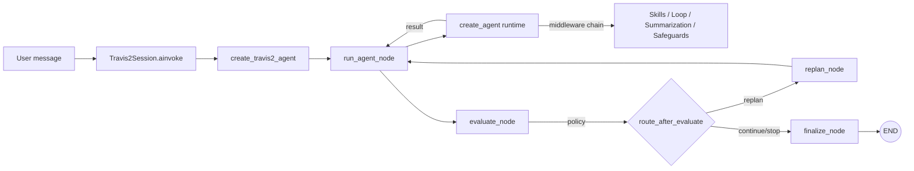

# အခန်း ၆ — `travis_2` ကို ခွဲခြမ်းစိတ်ဖြာခြင်း: LangChain + LangGraph လက်တွေ့အသုံးချမှု

## ၆.၁ နိဒါန်းနှင့် ဖတ်ရှုလမ်းညွှန်

	ယခုအခန်းမှာ `travis_2` နမူနာကို အခြေခံပြီး LangChain နဲ့ LangGraph တို့ကို Production မှာ အသုံးပြုဖို့အတွက် Layered agent architecture ဘယ်လိုတည်ဆောက်မလဲဆိုတာကို အသေးစိတ် လေ့လာသွားမှာ ဖြစ်ပါတယ်။ စာဖတ်သူတွေအနေနဲ့ အောက်ပါ file တွေနဲ့ ယှဉ်တွဲပြီး လေ့လာဖို့ အကြံပြုလိုပါတယ် -

	- [agent.py]([travis2-root]/src/attalang_bot/travis_2/agent.py)
	- [utils/state.py]([travis2-root]/src/attalang_bot/travis_2/utils/state.py)
	- [utils/nodes.py]([travis2-root]/src/attalang_bot/travis_2/utils/nodes.py)
	- [utils/middleware.py]([travis2-root]/src/attalang_bot/travis_2/utils/middleware.py)
	- [utils/safe_summarization.py]([travis2-root]/src/attalang_bot/travis_2/utils/safe_summarization.py)
	- [utils/sanitization.py]([travis2-root]/src/attalang_bot/travis_2/utils/sanitization.py)

	ဒီ path တွေဟာ `attalang-bot` repository root (travis2-root) အောက်က path တွေပဲ ဖြစ်ပါတယ်။

## ၆.၂ အခန်း၏ ရည်ရွယ်ချက်များ

	ဒီအခန်းမှာ အောက်ပါအချက်တွေကို အဓိကထား တင်ပြသွားမှာဖြစ်ပါတယ် -

၁။ LangGraph control graph နဲ့ LangChain runtime တို့ကို အလွှာလိုက် ခွဲခြားတည်ဆောက်ပုံကို နားလည်စေရန်။
၂။ Reducers တွေသုံးပြီး agent state ကို တိကျစွာ modeling ပြုလုပ်ပုံကို သိရှိစေရန်။
၃။ Middleware-driven policy control တွေနဲ့ agent behavior ကို ဘယ်လိုထိန်းချုပ်မလဲဆိုတာ လေ့လာရန်။
၄။ Tool safety နဲ့ summarization နည်းလမ်းတွေသုံးပြီး agent ကို ပိုမိုခိုင်မာ (Harden) အောင် ပြုလုပ်ရန်။
၅။ Re-planning behavior နဲ့ state recovery mechanics တွေကို လက်တွေ့အသုံးချနိုင်ရန်။

---

## ၆.၃ ဤအခန်းသည် အဘယ်ကြောင့် အရေးပါသနည်း

	`travis_2` နမူနာဟာ ကျစ်လျစ်သိပ်သည်းပေမယ့် Production-oriented ဖြစ်ဖို့အတွက် ရည်ရွယ်တည်ဆောက်ထားတဲ့ Layered agent architecture ရဲ့ စံနမူနာကောင်းတစ်ခုပဲ ဖြစ်ပါတယ်။ သူ့မှာ အဓိက အစိတ်အပိုင်း နှစ်ခု ပါဝင်ပါတယ် -

	- **Outer layer**: LangGraph control graph (`StateGraph`)
	- **Inner layer**: LangChain `create_agent` runtime (LLM, Tools နဲ့ Middleware တွေ ပါဝင်ပါတယ်)

---

## ၆.၄ Architecture အနှစ်ချုပ်



	အထက်ပါ diagram အရ Outer graph က execution flow တစ်ခုလုံးကို ထိန်းချုပ်ပေးပြီး Inner runtime ကတော့ tool selection နဲ့ model call တွေလိုမျိုး လက်တွေ့လုပ်ဆောင်ချက်တွေကို တာဝန်ယူပေးပါတယ်။

---

## ၆.၅ State management သည် တိကျသော contract တစ်ရပ်ဖြစ်သည်

	Outer graph အတွက် မျှဝေအသုံးပြုတဲ့ State အဖြစ် `AgentState` ကို သတ်မှတ်ထားပါတယ် -

```python
class AgentState(TypedDict):
    messages: Annotated[list[AnyMessage], add_messages]
    last_output: str | None
    loop_detected: bool
    loop_reason: str | None
    loop_signals: LoopSignals
    policy_action: PolicyAction
    replan_count: int
    replan_hint: str | None
    recent_trajectory: list[TrajectoryEvent]
    trajectory_digest: str | None
    telemetry: dict[str, Any]
    budget_snapshot: dict[str, int]
```

Source: [state.py]([travis2-root]/src/attalang_bot/travis_2/utils/state.py)

### ၆.၅.၁ `Annotated[list[AnyMessage], add_messages]` ၏ အခန်းကဏ္ဍ

	`add_messages` ဟာ reducer-aware schema တစ်ခုဖြစ်ပြီး LangGraph အနေနဲ့ node outputs တွေကနေ message တွေကို ဘယ်လိုပေါင်းစပ်ရမလဲဆိုတာကို နားလည်စေပါတယ်။ Node တွေကနေ အောက်ပါ output အမျိုးအစား နှစ်မျိုးကို ပေးပို့နိုင်ပါတယ် -

	- **Append**: လက်ရှိ message သမိုင်းကြောင်းထဲကို message အသစ်တွေ ပေါင်းထည့်ခြင်း။
	- **Rewrite**: ယခင်သမိုင်းကြောင်း (History) တစ်ခုလုံးကို အသစ်ပြန်ရေးခြင်း။

### ၆.၅.၂ Turn initialization

	Turn တစ်ခုစီ စတင်တိုင်းမှာ `build_turn_input_state(...)` ကို အသုံးပြုပြီး `policy_action`၊ `loop_detected` နဲ့ `replan_count` စတဲ့ control signals တွေကို reset ပြန်လုပ်ပေးပါတယ်။ ဒါဟာ အသုံးပြုသူရဲ့ prompt အသစ်တစ်ခုစီအတွက် state တွေ မရှုပ်ထွေးသွားအောင် ကာကွယ်ပေးတာပဲ ဖြစ်ပါတယ်။

---

## ၆.၆ Outer graph topology ကို အသေးစိတ်လေ့လာခြင်း

	`create_travis2_agent()` မှာ အဓိက node ၄ ခုပါဝင်တဲ့ `StateGraph` တစ်ခုကို တည်ဆောက်ထားပါတယ် -

	- `run_agent`: Runtime agent ကို ခေါ်ယူအသုံးပြုတဲ့ node။
	- `evaluate`: ရလဒ်ကို စစ်ဆေးပြီး ဘယ်လမ်းကြောင်းသွားမလဲဆိုတာ ဆုံးဖြတ်တဲ့ node။
	- `replan`: လိုအပ်ချက်ရှိရင် ပြန်လည်ပြင်ဆင်ဖို့ hint တွေ ထုတ်ပေးတဲ့ node။
	- `finalize`: အလုပ်ပြီးဆုံးကြောင်း သတ်မှတ်ပေးတဲ့ node။

	Flow ရဲ့ ချိတ်ဆက်မှုကတော့ `START -> run_agent -> evaluate -> conditional(replan | finalize)` ပုံစံအတိုင်းပဲ ဖြစ်ပါတယ်။

---

## ၆.၇ `run_agent_node`: graph နှင့် runtime တွေ့ဆုံရာနေရာ

	`run_agent_node` ဟာ Outer State နဲ့ Inner Runtime အကြား ဆက်သွယ်ပေးတဲ့ တံတားတစ်ခုပဲ ဖြစ်ပါတယ်။

	သူ့ရဲ့ အဓိက တာဝန်တွေကတော့ -

	၁) Outer state ကနေ runtime အတွက် လိုအပ်တဲ့ data တွေကို ယူပေးခြင်း။
	၂) `replan_hint` ရှိရင် model အတွက် hint message အဖြစ် ပြောင်းလဲထည့်သွင်းပေးခြင်း။
	၃) Runtime ကို isolation ကောင်းကောင်းနဲ့ ခေါ်ယူအသုံးပြုခြင်း။
	၄) Runtime ကထွက်လာတဲ့ output တွေကို outer state updates တွေအဖြစ် ပြန်ပြောင်းပေးခြင်း။

Source: [utils/nodes.py]([travis2-root]/src/attalang_bot/travis_2/utils/nodes.py)

---

## ၆.၈ Message updates: reducer-safe append နှင့် rewrite

	ဒါဟာ LangGraph မှာ အရေးကြီးဆုံး အစိတ်အပိုင်းတစ်ခုပဲ ဖြစ်ပါတယ်။

```python
def _calculate_message_delta(previous_messages, updated_messages):
    if _is_append_only_update(previous_messages, updated_messages):
        return list(updated_messages[len(previous_messages):])
    return [RemoveMessage(id=REMOVE_ALL_MESSAGES), *updated_messages]
```

	- **Append**: Runtime ကနေ history အသစ် (Diff) ကိုပဲ ပေးပို့တဲ့အခါ သုံးပါတယ်။
	- **Rewrite**: Runtime က history ကို rewrite လုပ်လိုက်တဲ့အခါ (ဥပမာ- summarization) လုပ်တဲ့အခါ `RemoveMessage` ကို သုံးပြီး ယခင် message တွေကို ရှင်းထုတ်ပစ်ပါတယ်။

---

## ၆.၉ Replan control flow နှင့် policy routing

	`evaluate_node` ဟာ `policy_action` ကို ဖတ်ပြီး လမ်းကြောင်းခွဲပေးပါတယ် -

	- `continue` -> `finalize`
	- `replan` -> `replan` node
	- `stop` -> `finalize`

	`replan_node` ကတော့ `replan_count` ကို တိုးမြှင့်ပေးပြီး အလုပ်ပြန်လုပ်ဖို့အတွက် လိုအပ်တဲ့ strategy hint တွေကို ထုတ်ပေးပါတယ်။ ဒါကို နောက်ထပ် `run_agent_node` မှာ input အဖြစ် ပြန်သုံးမှာ ဖြစ်ပါတယ်။

---

## ၆.၁၀ Middleware stack ကို Chain-of-Responsibility အဖြစ်

	`build_default_middlewares()` မှာ middleware chain တစ်ခုကို စနစ်တကျ ဖွဲ့စည်းထားပါတယ် -

	၁။ Model call limits သတ်မှတ်ပေးခြင်း။
	၂။ Semantic loop detection ပြုလုပ်ခြင်း။
	၃။ Tool output sanitization ပြုလုပ်ခြင်း။
	၄။ Todo နဲ့ Skill injection တွေ ထည့်ပေးခြင်း။
	၅။ Context editing နဲ့ Summarization ပြုလုပ်ခြင်း။

	ဒီ Middleware တွေဟာ တစ်ခုချင်းစီ သီးခြားစီ အစားထိုးနိုင်တဲ့ behavior modules တွေပဲ ဖြစ်ပါတယ်။

---

## ၆.၁၁ LangGraph + LangChain runtime boundary

	`create_travis2_agent` က Outer Graph နဲ့ Inner Runtime ကို သီးခြားစီ ခွဲထုတ်ထားတဲ့အတွက် tool-calling လုပ်ငန်းစဉ်တွေနဲ့ graph flow တွေကို သီးခြားစီ audit လုပ်နိုင်စေပါတယ်။

Source: [agent.py]([travis2-root]/src/attalang_bot/travis_2/agent.py)

---

## ၆.၁၂ Security နှင့် travis_2 ရှိ hardening layers များ

	`travis_2` မှာ hardening layers တွေကို အောက်ပါအတိုင်း အဆင့်ဆင့် ထည့်သွင်းထားပါတယ် -

### ၆.၁၂.၁ Sandboxed execution
- Docker runner နဲ့ သီးသန့် Docker network ကို သုံးပြီး code execution ကို isolate လုပ်ထားပါတယ်။

### ၆.၁၂.၂ AST validation
- TypeScript code တွေကို compile မလုပ်ခင်မှာ syntax နဲ့ security စစ်ဆေးမှုတွေ ပြုလုပ်ပါတယ်။

### ၆.၁၂.၃ Tool output sanitization
- Tool ကထွက်လာတဲ့ output တွေကို အရှည်ကန့်သတ်တာနဲ့ injection markers တွေကို ဖယ်ရှားတာမျိုးတွေ လုပ်ပါတယ်။

### ၆.၁၂.၄ Safe summarization နှင့် Skill signing
- Summarization logic ကို prompt injection မဖြစ်အောင် ကာကွယ်ထားသလို၊ Skill files တွေအတွက်လည်း HMAC integrity checks (`.sig`) တွေ သုံးထားပါတယ်။

---

## ၆.၁၃ `Travis2Session` နှင့် manual compaction

	`Travis2Session` ဟာ အသုံးပြုသူအတွက် ainvoke၊ astream နဲ့ compact (သမိုင်းကြောင်း အကျဉ်းချုပ်ခြင်း) တွေကို တစ်နေရာတည်းက လုပ်ဆောင်နိုင်အောင် စီစဉ်ပေးတဲ့ interface ပဲ ဖြစ်ပါတယ်။

---

## ၆.၁၄ Design patterns များ လက်တွေ့အသုံးချခြင်း

၁။ **Strategy Pattern**: တစ်ခုချင်းစီ အစားထိုးနိုင်တဲ့ Middleware module များ။
၂။ **Command Pattern**: Explicit schema နဲ့ tools များ ခေါ်ယူခြင်း။
၃။ **Decorator / Interceptor Pattern**: Model call တွေကို safety layers တွေနဲ့ ဝန်းရံခြင်း။
၄။ **Template Method Pattern**: ပုံသေ သတ်မှတ်ထားတဲ့ orchestration flow။

---

## ၆.၁၅ Code review နှင့် သင်ခန်းစာများ

	ဒီအပိုင်းမှာ `travis_2` ကို review လုပ်ရင်း တွေ့ရှိခဲ့တဲ့ သင်ခန်းစာတွေကို တင်ပြသွားမှာ ဖြစ်ပါတယ်။

### အဓိက သတိပြုရန်အချက်များ

- **Runtime vs Graph State Schema Mismatch (အရေးပါသည့် အချက်အလက်)**:
	Review လုပ်နေရင်းနဲ့ ကျွန်ုပ်ကိုယ်တိုင် မှားယွင်းခဲ့တဲ့ ဒီဇိုင်းအမှားတစ်ခုကို တွေ့ရှိခဲ့ပါတယ် -

	- `run_agent_node` က runtime ဆီကနေ `policy_action` ကို ပြန်ရဖို့ မျှော်လင့်ထားပေမယ့်၊ `create_agent` ကို တည်ဆောက်တဲ့နေရာမှာ `state_schema` ကို ထည့်မပေးခဲ့မိပါဘူး။
	- တိကျတဲ့ state schema မရှိတဲ့အတွက် middleware ကနေ ထုတ်ပေးလိုက်တဲ့ `policy_action` တွေဟာ runtime ရဲ့ ပုံမှန် schema ထဲမှာ မပါဝင်တဲ့အတွက် ပျောက်ကွယ်သွားခဲ့ပါတယ်။
	- အကျိုးဆက်အနေနဲ့ `evaluate_node` ဟာ `"replan"` signal ကို ဘယ်တော့မှ လက်ခံရရှိတော့မှာ မဟုတ်ဘဲ၊ agent က အမှားတွေကို ပြန်မပြင်နိုင်တော့တဲ့ အခြေအနေမျိုး ဖြစ်သွားပါတယ်။

	ဒါဟာ **LangGraph state contract** နဲ့ **LangChain runtime contract** တို့အကြားက နယ်နိမိတ်ကို သတိမမူမိခဲ့ရာကနေ ဖြစ်ပေါ်လာတဲ့ သင်ခန်းစာတစ်ခုပဲ ဖြစ်ပါတယ်။

	**အကြံပြုချက် -** Middleware တွေ သုံးတဲ့ control fields တွေအတွက် runtime state schema တစ်ခုကို သီးခြားသတ်မှတ်ပြီး runtime call ထဲမှာ တိကျစွာ ထည့်သွင်းပေးရမှာ ဖြစ်ပါတယ်။

### လိုအပ်ချက်များ

- **Message Corruption Risk**: Message lists တွေမှာ IDs တွေ ပျောက်ဆုံးနေတာကို rewrite အဖြစ် သတ်မှတ်တဲ့နေရာမှာ ပိုပြီး တိကျတဲ့ validation တွေ လိုအပ်ပါတယ်။
- **Config Isolation Leakage**: Pregel ရဲ့ internal fields တွေ runtime ထဲကို မပေါက်ကြားအောင် filter လုပ်ဖို့ လိုပါတယ်။

### အားသာချက်များ

- Middleware stack ကို Chain-of-Responsibility အဖြစ် အသုံးပြုထားတဲ့အတွက် စနစ်ကို လွယ်လွယ်ကူကူ expand လုပ်နိုင်ပါတယ်။
- Replan hints တွေကို state ထဲမှာ အမြဲတမ်း persist မလုပ်ဘဲ လိုအပ်မှသုံးတဲ့နည်းလမ်းက history ကို ပိုပြီး သန့်ရှင်းစေပါတယ်။

---

## ၆.၁၆ Test-backed confidence map

	ယုံကြည်စိတ်ချရတဲ့ စမ်းသပ်ချက်တွေ (Tests) ကတော့ -

	- state & node semantics: [tests/test_travis_2_nodes.py]([travis2-root]/tests/test_travis_2_nodes.py)
	- middleware behavior: [tests/test_travis_2_middleware.py]([travis2-root]/tests/test_travis_2_middleware.py)
	- session and compaction: [tests/test_travis_2_agent.py]([travis2-root]/tests/test_travis_2_agent.py)

---

## ၆.၁၇ အနှစ်ချုပ်

	`travis_2` ဟာ state design၊ flow orchestration နဲ့ safety middleware တွေကို ဘယ်လို သပ်ရပ်စွာ ခွဲခြားတည်ဆောက်ရမလဲဆိုတာကို ပြသပေးတဲ့ အကောင်းဆုံး စံနမူနာတစ်ခု ဖြစ်ပါတယ်။ ဒီခွဲခြားမှုဟာ LangChain နဲ့ LangGraph ကို လက်တွေ့အသုံးချရာမှာ အလွန်အရေးကြီးတဲ့ အချက်ပဲ ဖြစ်ပါတယ်။

---

## ၆.၁၈ `travis_2` Implementation Checklist

၁။ Middleware အစီအစဉ် မှန်ကန်မှုကို ပြန်စစ်ပါ။
၂။ Runtime မှာ `state_schema` ပါဝင်ကြောင်း သေချာအောင် လုပ်ပါ။
၃။ Rewrite လုပ်တဲ့အခါ `RemoveMessage` ကို မမေ့မလျော့ အသုံးပြုပါ။
၄။ Tool output sanitization rules တွေဟာ context နဲ့ ကိုက်ညီမှုရှိမရှိ စစ်ဆေးပါ။
၅။ Replan hints တွေကို session history ထဲ မရောက်အောင် filter လုပ်ပါ။

---

## ၆.၁၉ ကိုယ်တိုင်စမ်းသပ်ရန် လေ့ကျင့်ခန်းများ

၁။ Middleware အသစ်တစ်ခု ထည့်သွင်းပြီး flow တစ်ခုလုံးကို ဘယ်လို သက်ရောက်မှုရှိလဲ စမ်းသပ်ကြည့်ပါ။
၂။ Summarization logic ကို trigger လုပ်ပြီး message တွေ ဘယ်လို ရှင်းထုတ်သွားလဲဆိုတာ လေ့လာပါ။
၃။ `state_schema` မပါဘဲ run ကြည့်ပြီး agent ရဲ့ replan behavior ဘယ်လို ကျိုးပျက်သွားလဲဆိုတာကို မျက်မြင်ကိုယ်တွေ့ စမ်းသပ်ပါ။

---

## Sources and verification strategy

- အပြောင်းအလဲတွေ မလုပ်ခင် tests တွေကို အရင် run ဖို့ အကြံပြုလိုပါတယ်။
- Edge cases တွေအတွက် assertion-based tests တွေနဲ့ validate လုပ်ပါ။
