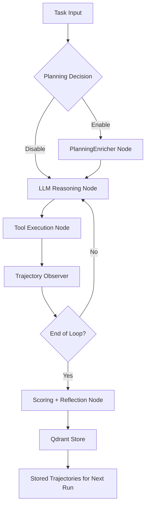
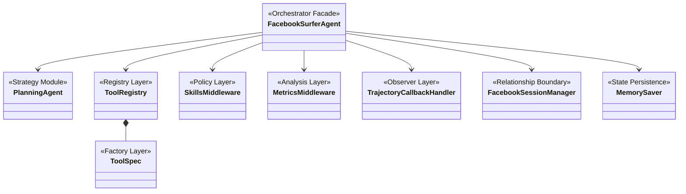

# အခန်း ၇ — DeepAgents Runtime၊ LangGraph Execution Semantics နှင့် Design Patterns လက်တွေ့အသုံးချခြင်း

## ၇.၁ နိဒါန်းနှင့် ဖတ်ရှုလမ်းညွှန်

	ယခုအခန်းတွင် prototype အဖြစ် အသုံးပြုထားသော `bot` codebase ကို LangChain၊ LangGraph နှင့် DeepAgents abstraction အပေါ် အခြေခံ၍ ခွဲစိတ်လေ့လာထားသည်များကို တင်ပြပါမည်။ စာဖတ်သူများအနေဖြင့် လက်တွေ့ကျကျ နားလည်စေရန် အောက်ပါ file များနှင့် ယှဉ်တွဲလေ့လာသင့်ပါသည် -

  - [src/agents/facebook_surfer.py]([project-root]/src/agents/facebook_surfer.py)
  - [src/agents/planner.py]([project-root]/src/agents/planner.py)
  - [src/tools/registry.py]([project-root]/src/tools/registry.py)
  - [src/tools/security.py]([project-root]/src/tools/security.py)
  - [src/metrics/trajectory_callback.py]([project-root]/src/metrics/trajectory_callback.py)
  - [src/metrics/scoring.py]([project-root]/src/metrics/scoring.py)
  - [src/session/__init__.py]([project-root]/src/session/__init__.py)

	Link path များမှာ repository root အောက်ရှိ path အပြည့်အစုံများ ဖြစ်ကြပါသည်။

## ၇.၂ အခန်း၏ ရည်ရွယ်ချက်များ

	ဤအခန်းတွင် အောက်ပါအချက်များကို အဓိကထား တင်ပြသွားမည်ဖြစ်သည် -

၁။ LangGraph-based agent runtime ကို DeepAgents wrapper များမှတစ်ဆင့် မည်သို့ တည်ဆောက်ထားသည်ကို နားလည်ရန်။
၂။ Runtime ကို decision၊ tool နှင့် state-update node များပါဝင်သော graph တစ်ခုအဖြစ် မြင်ယောင်လေ့လာရန်။
၃။ `thread_id`၊ checkpointing နှင့် store ကဲ့သို့သော state primitives များကို လုံခြုံစွာ အသုံးပြုရန်။
၄။ Relationship နှင့် strategy patterns ကဲ့သို့သော reusable design patterns များကို ကိုယ်ပိုင် project တွင် အသုံးချနိုင်ရန်။
၅။ လက်တွေ့ကျသော code review များမှတစ်ဆင့် logic tradeoff နှင့် intent များ၏ အရေးပါပုံကို သင်ခန်းစာယူရန်။

	ယခုအခန်းသည် LangGraph အခြေခံများကို စတင်လေ့လာသူများအတွက် ရည်ရွယ်ထားသဖြင့် အစပိုင်းတွင် သီအိုရီပိုင်းကို ရှင်းလင်းထားပြီး၊ နောက်ပိုင်းတွင်မူ လက်တွေ့ကျသော implementation နှင့် audit-oriented အချက်အလက်များကို ပိုမိုဦးစားပေး တင်ပြထားပါသည်။

---

## ၇.၃ Runtime entrypoint မှ full execution သို့

	ကျွန်ုပ်တို့၏ Prototype သည် အောက်ပါ execution flow အတိုင်း လုပ်ဆောင်ပါသည် -

	User prompt → request normalization → agent invocation → tool selection and execution → optional planner feedback → security checks → metric capture → final assistant message။

	အရေးကြီးသော implementation anchor မှာ [`FacebookSurferAgent`]([project-root]/src/agents/facebook_surfer.py) ရှိ orchestration ပင်ဖြစ်သည်။ ၎င်းသည် runtime configuration ကို လက်ခံပြီး executable graph runner တစ်ခုကို ပြန်လည်ပေးပို့ပါသည်။

```python
agent = FacebookSurferAgent(...)
result = await agent.invoke(
    task=task,
    thread_id=thread_id,
)
```

	ဤချဉ်းကပ်ပုံမှာ အောက်ပါအကြောင်းရင်းများကြောင့် လေ့လာသင့်ပါသည် -

	- "Agent class" တစ်ခုအနေဖြင့် ရှုပ်ထွေးသော library details များကို stable interface တစ်ခု၏ နောက်ကွယ်တွင် ဖုံးကွယ်ထားနိုင်ခြင်း။
	- External callers များအနေဖြင့် internal ပြောင်းလဲမှုများကို သိရှိစရာမလိုဘဲ method တစ်ခုတည်းနှင့်သာ အပြန်အလှန်လုပ်ဆောင်နိုင်ခြင်း။
	- Production libraries များကို library internals ကို တိုက်ရိုက်မထိတွေ့ဘဲ capability အပေါ် အခြေခံ၍ မည်သို့ အသုံးပြုသင့်သည်ကို ပြသထားခြင်း။

	LangGraph graph သည် အမှန်တကယ်ရှိသော်လည်း ၎င်းကို encapsulate လုပ်ထားခြင်းဖြစ်သည်။ Framework layer တစ်ခုဖြစ်သော `deepagents` (ယခု project အတွက် သီးသန့်ဖန်တီးထားသော custom wrapper) ကို အသုံးပြုခြင်းဖြင့် raw node/edge definition များကို ကိုယ်တိုင်ရေးသားစရာမလိုဘဲ အသင့်သုံးနိုင်မည် ဖြစ်သည်။

---

## ၇.၄ DeepAgents ကို LangGraph concepts ဖြင့် ခွဲစိတ်ခြင်း

	ဤ repository တွင် graph creation ကို DeepAgents သို့ လွှဲထားသော်လည်း၊ node များကို ကိုယ်တိုင်ရေးသားရမည်ဆိုလျှင် မည်သို့ချဉ်းကပ်ရမည်ကို သိရှိထားရန် လိုအပ်ပါသည်။ ထို့ကြောင့် graph အပေါ် ဆင်ခြင်တွေးတောမှု (reasoning) ပြုလုပ်နိုင်ရန် အောက်ပါအတိုင်း တင်ပြလိုပါသည်။
---
### ၇.၄.၀ DeepAgents နှင့် LangGraph အကြား abstraction layer

	ဤ project ၏ graph ကို `create_deep_agent(...)` နှင့် တည်ဆောက်ထားသည်ကို တွေ့ရပါလိမ့်မည်။ ဆိုလိုသည်မှာ `src/agents/facebook_surfer.py` တွင် raw `StateGraph` syntax များကို တိုက်ရိုက်တွေ့ရမည် မဟုတ်ဘဲ၊ DeepAgents က အောက်ပါတို့ကို abstraction အနေဖြင့် ဆောင်ရွက်ပေးခြင်းဖြစ်သည် -

- `model`၊ tools၊ middleware၊ checkpointer နှင့် interrupt config တို့ကို ပေါင်းစပ်ကာ graph skeleton ကို ချိတ်ဆက်ပေးခြင်း။
- `agent.ainvoke(...)` တစ်ခုတည်းဖြင့်ပင် ကြိုတင်တည်ဆောက်ထားသော LangGraph execution engine ကို အသုံးပြုနိုင်ခြင်း။
- `configurable.thread_id` စသည်တို့ဖြင့် thread state ကို graph runtime မှ စီမံခန့်ခွဲပေးခြင်း။

	အဓိက သတိပြုရန်အချက်များမှာ -

- DeepAgents သည် LangGraph ကိုပင် အခြေခံထားသော်လည်း၊ raw graph code များကို ရှောင်ရှားကာ framework DSL တစ်ခုကဲ့သို့ အသုံးပြုထားခြင်း ဖြစ်သည်။
- `facebook_surfer.py` သည် orchestration layer တစ်ခုကဲ့သို့ အလုပ်လုပ်ပြီး၊ graph ၏ behavior ကို runtime configuration ဖြင့် ဖန်တီးထားပါသည်။
- ဤအခန်းတွင် အဓိက လေ့လာရမည့်အချက်မှာ code တစ်ကြောင်းချင်းစီထက် **graph behavior contract** များသာ ဖြစ်သည်။

	သို့ဖြစ်၍ ဤအခန်းတွင် ပြသမည့် node နှင့် edge များသည် hard-coded source code များ မဟုတ်ဘဲ၊ runtime သဘောတရားများအပေါ် အခြေခံထားသော mental model တစ်ခုသာ ဖြစ်ပါသည်။
---
### ၇.၄.၁ Review လုပ်စဉ် အသုံးပြုသင့်သော graph view

- Input adaptation node
- Policy/planning node (`PlanningAgent` enable လုပ်ထားချိန်)
- Model reasoning node
- Tool dispatch node(s)
- Human-in-the-loop edge (optional)
- Security/sanitization edge
- Metrics and trajectory capture node
- Reply emission node

	အထက်ပါ flow အတိုင်း လုပ်ဆောင်ချက်များကို tool call logs များ၊ interrupts များနှင့် callback transitions များတွင် တွေ့မြင်နိုင်ပါသည်။

### ၇.၄.၂ Conceptual edges များ

- LLM က tool call တစ်ခုကို ရွေးချယ်ပါက execution သည် input→planner→LLM→tool edge အတိုင်း စီးဆင်းသည်။
- Tool call မလိုအပ်ပါက execution သည် input→model→finalization edge အတိုင်း သွားပါသည်။
- Tool output သည် state အဖြစ် model path ထဲသို့ ပြန်လည်ဝင်ရောက်ပြီး နောက်ထပ် tool decision သို့မဟုတ် final answer ကို ထုတ်ပေးပါသည်။
- Runtime interrupts များသည် human checkpoint သို့ side edge တစ်ခုကို ထုတ်ပေးလေ့ရှိသည်။
- Planning output သည် state ကို ပိုမိုပြည့်စုံစေပြီး model reasoning သို့ ပြန်လည် loop ပတ်စေပါသည်။

	၎င်းသည် classic LangGraph control pattern ပင်ဖြစ်သည် - **linear flow သာမက execution state အလိုက် conditional edges များဖြင့် ဖွဲ့စည်းထားခြင်း** ဖြစ်ပါသည်။

### ၇.၄.၃ Correctness အတွက် အဘယ်ကြောင့် အရေးကြီးသနည်း

- Bug အများစုသည် edge boundaries များတွင် ပေါ်လာတတ်သည် (ဥပမာ - မှားယွင်းသော state shape၊ ပျောက်ဆုံးနေသော fields သို့မဟုတ် thread ID မရှိခြင်း)။
- Callback observability သည် node boundaries များတွင်ပါ ချိတ်ဆက်မှသာ အထိရောက်ဆုံး ဖြစ်နိုင်သည်။
- End-to-end output ကိုသာ စစ်ဆေးပါက loop behavior နှင့် edge miswiring များကို မြင်တွေ့နိုင်မည် မဟုတ်ပါ။

---

## ၇.၅ State ကို မည်သို့ စီမံခန့်ခွဲသနည်း

	LangGraph runtime သည် ဒီဇိုင်းအရ stateful ဖြစ်ပါသည်။ ယခု repository တွင် ဤအချက်ကို နေရာသုံးခု၌ ဖော်ပြထားပါသည် -

၁။ Configurable execution IDs မှတစ်ဆင့် **per-thread execution state**
၂။ Turn များတစ်လျှောက် conversation state ကို ထိန်းသိမ်းသော **persistent checkpointers**
၃။ Cross-turn နှင့် cross-node shared memory အတွက် **tool/runtime context stores**

	ယခု project တွင် thread-level execution သည် မရှိမဖြစ် လိုအပ်ချက်တစ်ခု ဖြစ်သည်။

```python
config = {"configurable": {"thread_id": session_id}}
```

	`thread_id` သည် graph execution lineage တစ်ခု၏ identity ဖြစ်သည်။ ၎င်းမရှိပါက -

	- turn များ ရောထွေးသွားနိုင်ခြင်း၊
	- trajectories များ ပြန်လည်ရယူ၍ မရနိုင်ခြင်း၊
	- metrics နှင့် planner context များ drift ဖြစ်သွားနိုင်ခြင်း တို့ ဖြစ်ပေါ်နိုင်ပါသည်။

### ၇.၅.၁ Checkpointer ၏ အခန်းကဏ္ဍ

	Project သည် agent စုစည်းစဉ်တွင် `MemorySaver` မှတစ်ဆင့် LangGraph checkpointer behavior ကို အသုံးပြုပါသည်။ ၎င်းသည် file/DB persistence strategy သက်သက် မဟုတ်ဘဲ၊ active execution lineage အတွက် graph-state persistence mechanism တစ်ခု ဖြစ်သည်။

	၎င်း၏ သက်ရောက်မှုများမှာ -

	- Active thread တစ်ခုအတွက် deterministic replay ပြုလုပ်နိုင်ခြင်း။
	- Tool outcomes နှင့် model state transitions များသည် step boundaries များကို ကျော်လွန်၍ တည်ရှိနိုင်ခြင်း။
	- State snapshots များ explicit ဖြစ်သောကြောင့် resume လုပ်ခြင်းနှင့် debugging ပြုလုပ်ခြင်းတို့ ပိုမိုလွယ်ကူခြင်း။

### ၇.၅.၂ Store ၏ အခန်းကဏ္ဍ

	ယခု prototype တွင် အသုံးပြုသော `InMemoryStore` သည် လျင်မြန်စွာ စမ်းသပ်ရန်အတွက် ကောင်းမွန်သော်လည်း -

	- ၎င်းသည် ယာယီ (ephemeral) သာ ဖြစ်ပါသည်။
	- Production-ready durable conversation memory မဟုတ်ပါ။
	- Checkpointing ကို အစားထိုး၍ မရဘဲ၊ complementary context storage အဖြစ်သာ အသုံးပြုနိုင်ပါသည်။

	ဤကွဲပြားချက်များကို သတိမပြုမိပါက production ပိုင်းတွင် ကြီးမားသော အမှားများ ဖြစ်ပေါ်စေနိုင်ပါသည်။

### ၇.၅.၃ State shape နှင့် schema

	ယခု project ရှိ state shape ကို လက်တွေ့ကျကျ တည်ဆောက်ထားပါသည် - messages၊ planning notes၊ tool results၊ trajectory summaries နှင့် runtime metadata များကို execution state တွင် ပေါင်းစပ်ထားခြင်း ဖြစ်သည်။ အသုံးပြုသင့်သော pattern မှာ -

	- graph အတွက် တကယ်လိုအပ်သည်များကိုသာ ထားရှိရန်။
	- ဖြစ်နိုင်ပါက canonical stores မှ context ကို derive လုပ်ရန်။
	- session store နှင့် checkpoint state ကြားတွင် semantic fields များကို duplicate မလုပ်ရန်။

---

## ၇.၆ အရေးကြီးသော class patterns များ

### ၇.၆.၁ `FacebookSurferAgent` — Facade pattern

	ဤ class သည် အောက်ပါတို့ကို စနစ်တကျ ချိတ်ဆက်ပေးသော entrypoint ဖြစ်သည် -

	- model configuration
	- toolset နှင့် registries
	- middleware နှင့် safety decorators
	- planner optionality
	- checkpointing နှင့် store components
	- callback handlers

	Pattern သင်ခန်းစာများမှာ -

	- **Facade** - caller များအနေဖြင့် ရှုပ်ထွေးသော orchestration အတွက် interface တစ်ခုတည်းကိုသာ အသုံးပြုနိုင်ခြင်း။
	- **Internal wiring** - dependency များကို constructor parameters အဖြစ် လက်ခံခြင်း မဟုတ်ဘဲ `__init__` အတွင်း၌ ကိုယ်တိုင်တည်ဆောက်ထားခြင်း ဖြစ်သည်။ ၎င်းသည် Facade pattern ၏ ရိုးရှင်းသောပုံစံဖြစ်ပြီး full Composition Root မဟုတ်သည်ကို သတိပြုသင့်ပါသည်။
	- **Testability tradeoff** - dependency များကို internal construction ဖြင့် hardcode ထားသောကြောင့် tests များတွင် mock လုပ်ရန် constructor injection ထက် ပိုမိုခက်ခဲနိုင်ပါသည်။

	ဤနေရာသည် readability ကောင်းမွန်ရန် အထူးလိုအပ်ပါသည်။

### ၇.၆.၂ `PlanningAgent` — Strategy pattern

	Planning သည် ဤ project တွင် စိတ်ကြိုက်ပြင်ဆင်နိုင်သော အစိတ်အပိုင်း ဖြစ်သည်။ ထို့ကြောင့် ၎င်း၏ behavior မှာ strategy တစ်ခုဖြစ်ပြီး အောက်ပါတို့ကို လုပ်ဆောင်နိုင်ပါသည် -

	- planning မပါသော baseline behavior
	- generated plan injection ဖြင့် proactive planning mode
	- planner-informed tool selection

	၎င်းသည် feature toggle သက်သက် မဟုတ်ဘဲ **dynamic strategy selection mechanism** တစ်ခု ဖြစ်သည်။

```python
if enable_planning:
    planner = PlanningAgent(...)
    plan = await planner.craft_success_plan(task)
    enhanced_task = f"Task: {task}\n\nSuccess Plan:\n{plan}"
```

	Design implications များမှာ -

	- Planning strategy ကို အခြား node များအပေါ် သက်ရောက်မှု အနည်းဆုံးဖြင့် swap လုပ်နိုင်ခြင်း။
	- Tool registries တူညီစွာဖြင့် planning-on/off behavior ကို နှိုင်းယှဉ်စမ်းသပ်နိုင်ခြင်း။

### ၇.၆.၃ `ToolSpec` နှင့် `ToolRegistry` — Registry + Factory pattern

	Tools များကို ဗဟိုမှ register လုပ်ပြီး metadata contracts များမှတစ်ဆင့် ဖန်တီးပါသည် -

	- `ToolSpec` သည် metadata နှင့် invocation semantics ကို သတ်မှတ်ပါသည်။
	- Registry သည် tool metadata ကို သိမ်းဆည်းပြီး available tools များကို name ဖြင့် resolve လုပ်ပေးပါသည်။
	- Tool definition များသည် Pydantic model များမှတစ်ဆင့် schema ကို သယ်ဆောင်သွားပါသည်။

	Pattern effects များမှာ -

	- Tool အသစ်ထည့်ရာတွင် orchestration logic ကို ပြောင်းလဲရန် မလိုခြင်း။
	- Tool discovery နှင့် governance ကို policy-driven ပြုလုပ်နိုင်ခြင်း။
	- Security wrappers များကို registration မတိုင်မီ တပြေးညီ apply လုပ်နိုင်ခြင်း။

### ၇.၆.၄ `SkillsMiddleware`၊ `MetricsMiddleware` နှင့် callback layers

	ဤ component များသည် execution lifecycle ၏ မတူညီသော အဆင့်များတွင် အလုပ်လုပ်ကြပါသည် -

	- `SkillsMiddleware` သည် `create_deep_agent` တွင် အသုံးပြုသော **graph-internal middleware** ဖြစ်ပြီး၊ execution အတွင်း၌ skill normalization နှင့် context injection ကို ဆောင်ရွက်ပါသည်။
	- `MetricsMiddleware` သည် **post-execution processor** ဖြစ်ပြီး၊ execution ပြီးဆုံးမှသာ trajectory capture နှင့် scoring ကို ဆောင်ရွက်ပါသည်။
	- `TrajectoryCallbackHandler` သည် LangChain callback system မှတစ်ဆင့် execution အတွင်း၌ tool call event များကို passive စောင့်ကြည့်Capture လုပ်ပါသည်။

	ဤ component သုံးခုသည် lifecycle stage သုံးခုတွင် သီးခြားစီ အလုပ်လုပ်ကြခြင်း ဖြစ်သည် -
	- `SkillsMiddleware` = pre/during execution
	- `TrajectoryCallbackHandler` = during execution
	- `MetricsMiddleware` = post-execution

### ၇.၆.၅ Session classes — Relationship architecture

	`FacebookSessionManager` နှင့် `src/session/__init__.py` ရှိ session aliases များသည် relationship model တစ်ခုကို ဖော်ပြပါသည် -

	- tools နှင့် browser sessions များသည် session registry တစ်ခုကို မျှဝေအသုံးပြုခြင်း။
	- stateful automation sessions များသည် business logic နှင့် decouple ဖြစ်နေခြင်း။
	- retrieval helpers များသည် cross-cutting identity နှင့် lifecycle ကို စုစည်းထားခြင်း။

	၎င်းသည် **relationship-oriented design** တစ်ခု ဖြစ်ပြီး tool တစ်ခုမှ session lifecycle ကို တိုက်ရိုက် control မလုပ်သောကြောင့် coupling လျော့နည်းစေပါသည်။

### ၇.၆.၆ `TrajectoryCallbackHandler` — Observer pattern

	Callback layer သည် execution event များကို passive စောင့်ကြည့်ပါသည်။

	- tool call started/completed
	- prompt/response transitions
	- loop detection

	၎င်းသည် scoring နှင့် debugging အတွက် လိုအပ်သော trajectory events များကို append-only စနစ်ဖြင့် မှတ်တမ်းတင်ပေးပါသည်။ ၎င်းကို **Observer** pattern သို့မဟုတ် audit trail တစ်ခုအဖြစ် မြင်နိုင်ပါသည်။ ၎င်းသည် state rollback/restore ပြုလုပ်သော Memento pattern နှင့် မတူညီသည်ကို သတိပြုရန် လိုအပ်ပါသည်။

---

## ၇.၇ Graph + OOP design relationship map

	ဤ project ၏ အဓိက relationship များကို အောက်ပါအတိုင်း တွေ့မြင်နိုင်ပါသည် -

	- **FacebookSurferAgent (Orchestrator)** - planner၊ tool registry၊ middleware၊ callback handlers နှင့် persistence components များကို စုစည်းပေးသည်။
	- **Graph Runtime** - execution state transition၊ tool invocation edges နှင့် finalization များကို တာဝန်ယူသည်။
	- **Tool Layer** - tool output နှင့် failure payloads များကို ပြန်လည်ပေးပို့သည်။
	- **Metrics Layer** - execution event နှင့် trajectory state များကို အသုံးပြု၍ scoring ပြုလုပ်သည်။

	ဤသို့ စီစဉ်ထားခြင်းမှာ ခိုင်မာသော layering strategy ကို ဖော်ပြနေခြင်းဖြစ်သည် -

၁။ orchestration layer
၂။ execution layer
၃။ data/tool layer
၄။ control/observability layer

---

## ၇.၈ Code review နှင့် သင်ခန်းစာများ

	ဤအပိုင်းတွင် prototype တွင် တွေ့ရှိနိုင်သော အားနည်းချက်များနှင့် ထိုမှတစ်ဆင့် ရရှိနိုင်သော သင်ခန်းစာများကို တင်ပြပါမည်။

### အဓိက သတိပြုရန်အချက်များ (High Severity)

- **Thread identity validation အားနည်းခြင်း** - `thread_id` flow တွင် တင်းကျပ်သော စစ်ဆေးမှုများ မရှိပါက session များကြားတွင် memory သို့မဟုတ် trajectory record များ leak ဖြစ်သွားနိုင်သည့် risk ရှိပါသည်။ Per-call validation ကို enforce လုပ်ရန်နှင့် ambiguous invocation များကို reject လုပ်ရန် အကြံပြုလိုပါသည်။
- **Unbounded tool side effects** - Automation tool များသည် environment ကို ပြောင်းလဲစေနိုင်ပါသည်။ Multi-turn graph များတွင် အမှားအယွင်းများ လျင်မြန်စွာ ပွားများတတ်သဖြင့် strict policy wrapper များ လိုအပ်ပါသည်။ Non-production mode များတွင် high-risk tools များအတွက် allowlist ထားရှိရန် လိုအပ်ပါသည်။

### တိုးတက်ရန် လိုအပ်ချက်များ (Medium Severity)

- **Persistence mismatch** - `InMemoryStore` နှင့် checkpointer များကို အသုံးပြုထားခြင်းမှာ local development အတွက် အဆင်ပြေစေသော်လည်း၊ production တွင် restarts များဖြစ်ပေါ်ပါက thread continuity ပျောက်ဆုံးသွားနိုင်ပါသည်။ Deploy profile များတွင် durable backend သို့ migrate လုပ်ရန် လိုအပ်ပါသည်။
- **Middleware ordering risks** - Orchestration constructor ရှိ middleware အစီအစဉ်သည် behavior ကို သက်ရောက်မှုရှိပါသည်။ အစီအစဉ် မှားယွင်းသွားပါက metric attribution သို့မဟုတ် sanitization guarantees များ လွဲချော်သွားနိုင်ပါသည်။ အစီအစဉ်ကို constant list တစ်ခုအဖြစ် သတ်မှတ်ထားသင့်ပါသည်။
- **Planner context management** - Planning text များ လွန်စွာရှည်လျားပါက model behavior ကို bias ဖြစ်စေနိုင်ပြီး token cost ကိုလည်း မြင့်တက်စေပါသည်။ Max token budget နှင့် freshness control (TTL) များ ထားရှိသင့်ပါသည်။

### အသေးစား ပြင်ဆင်ချက်များ (Low Severity)

- **Cognitive load from session aliases** - Session module ရှိ alias နှင့် compatibility symbols များစွာရှိနေခြင်းမှာ အသစ်လေ့လာသူများအတွက် နားလည်ရ ခက်ခဲစေနိုင်ပါသည်။ Deprecation markers နှင့် ရှင်းလင်းသော docs များ ထည့်သွင်းပေးရန် လိုအပ်ပါသည်။
- **Security wrapper consistency** - Output sanitization များကို နေရာအနှံ့တွင် manually လုပ်ဆောင်နေမည့်အစား၊ tool output အားလုံးအတွက် single choke point တစ်ခု ထားရှိခြင်းက ပိုမိုစိတ်ချရစေပါသည်။

### အားသာချက်များ (Strengths)

- `ToolRegistry` နှင့် Pydantic schema ကို အသုံးပြုခြင်းမှာ extensibility အတွက် အလွန်ကောင်းမွန်သော pattern ဖြစ်ပါသည်။
- Trajectory analysis တွင် loop detection guardrail ပါဝင်ခြင်းမှာ စနစ်၏ ရင့်ကျက်မှုကို ဖော်ပြနေပါသည်။
- `TrajectoryCallbackHandler` ကို passive observer အဖြစ် သီးခြားထားရှိခြင်းမှာ explainability ကို ပေးစွမ်းနိုင်ပါသည်။
- Component များအကြား ရှင်းလင်းစွာ ခွဲခြားထားခြင်းမှာ complexity ကို လျှော့ချပေးနိုင်ပါသည်။

---

## ၇.၉ အဓိက code blocks များကို လေ့လာခြင်း

### Example A — Tool registration (Registry pattern)

```python
registry = ToolRegistry()
registry.register(ToolSpec(
    name="browser_click",
    category=ToolCategory.interaction,
    description="Click on an element",
    func=browser_click,
    args_schema=ClickArgs,
))
available_tools = registry.get_all()
```

	လေ့လာသင်ယူရမည့်အချက်များမှာ -
	- registry များသည် extensibility ကို ပိုမိုကောင်းမွန်စေခြင်း။
	- tool အသစ်ထည့်သွင်းခြင်းသည် model graph logic ကို ပြောင်းလဲရန် မလိုအပ်ခြင်း။
	- behavior များမှာ declarative ဖြစ်နေခြင်း။

### Example B — Metrics instrumentation (Observer pattern)

```python
class TrajectoryCallbackHandler:
    def on_tool_start(...):
        ...
    def on_tool_end(...):
        ...
```

	လေ့လာသင်ယူရမည့်အချက်များမှာ -
	- telemetry သည် system execution အပေါ် သက်ရောက်မှု အနည်းဆုံးသာ ရှိသင့်ခြင်း။
	- final output သာမက event-level details များပါ သိမ်းဆည်းနိုင်ခြင်း။
	- scoring လုပ်ငန်းစဉ်များကြောင့် graph execution ကို မနှောင့်နှေးစေသင့်ခြင်း။

### Example C — Security (Output policy)

```python
wrapped_content, suspicious = wrap_and_check(result_text, "JS_RESULT")
return wrapped_content
```

	လေ့လာသင်ယူရမည့်အချက်များမှာ -
	- tool output ကို အမြဲတမ်း sanitize လုပ်သင့်ခြင်း။
	- raw data နှင့် redacted data ကို policy layer များတွင် ရှင်းလင်းစွာ ခွဲခြားထားသင့်ခြင်း။

---

## ၇.၁၀ Production-hardening အတွက် အကြံပြုချက်များ

၁။ Middleware order ကို named steps များဖြင့် `AGENT_MIDDLEWARE_CHAIN` constant ထဲသို့ သီးခြားထုတ်ယူပါ။
၂။ API boundaries များတွင် mandatory `thread_id` ကို explicit fallback behavior ဖြင့် enforce လုပ်ဆောင်ပါ။
၃။ In-memory storage ကို production deployment များတွင် configured persistence backends များဖြင့် အစားထိုးပါ။
၄။ အဓိကကျသော edge တစ်ခုစီအတွက် (planner၊ tool၊ interrupt၊ finalization) contract test များ ထည့်သွင်းပါ။
၅။ Tool registration manifest များကို publish လုပ်ပြီး names၊ schemas နှင့် execution rights များကို auto-validate ပြုလုပ်ပါ။
၆။ Failed-trajectory tests များတွင် state snapshots များ ထည့်သွင်းပြီး graph replay ကို တိကျစွာ validate လုပ်နိုင်အောင် ပြုလုပ်ပါ။

---

## ၇.၁၁ RAG planning နှင့် Reflection ကို အသုံးပြုသော Self-Learning Design

	ဤအပိုင်းတွင် `bot` prototype ရှိ **Plan → Execute → Observe → Store → Re-use** cycle ကို LangGraph design အဖြစ် ခွဲခြမ်းစိတ်ဖြာ တင်ပြပါမည်။

	ဤ cycle တွင် graph edge နှစ်ခု၏ အထောက်အပံ့ကို တွေ့ရပါသည် -

၁။ **Pre-execution planning edge** (`facebook_surfer.py` → `PlanningAgent`)
၂။ **Post-execution reflection edge** (`facebook_surfer.py` → `MetricsMiddleware` → `ReflectionAgent` → `Qdrant`)

### ၇.၁၁.၁ RAG planning edge (dynamic strategy injection)

	Planning ကို ဖွင့်ထားပါက execution အစောပိုင်းတွင် `self.planner.craft_success_plan(task)` ကို ခေါ်ယူပြီး အခြေအနေများနှင့် tool sequence တို့ကို history နှင့် reflection payload များမှ ပြန်လည်ရယူပါသည်။

	`PlanningAgent` အတွင်းရှိ `retrieve_similar_trajectories(...)` သည် Qdrant ကို အသုံးပြု၍ အောက်ပါတို့ကို ဆောင်ရွက်ပါသည် -
	- task ကို embedding အဖြစ် ပြောင်းလဲခြင်း။
	- similarity threshold ဖြင့် အရည်အသွေးကို စစ်ထုတ်ခြင်း။
	- `failed_patterns` နှင့် `successful_patterns` တို့ကို ထည့်သွင်းစဉ်းစားခြင်း။
	- အကောင်းဆုံးဖြစ်သော top-k trajectories များကို ရွေးချယ်ခြင်း။

	၎င်းသည် **Strategy Pattern** ပုံစံဖြစ်သည် -
	- Strategy ရွေးချယ်မှု = planning on/off
	- State အဖြစ် inject လုပ်သော အချက်အလက် = task context
	- သက်ရောက်မှုရှိသော node = `LLM reasoning node`

### ၇.၁၁.၂ Reflection edge (learning edge)

	Execution ပြီးဆုံးချိန်တွင် `TrajectoryCallbackHandler` က စုဆောင်းထားသော data များကို `MetricsMiddleware` သို့ ပေးပို့ပါသည်။

	`MetricsMiddleware` တွင် အောက်ပါတို့ကို လုပ်ဆောင်ပါသည် -
	- Scoring သတ်မှတ်ခြင်း။
	- `ReflectionAgent` မှတစ်ဆင့် trajectory ကို analyze လုပ်ခြင်း။
	- Reflection payload (`critique`၊ `successful_patterns`၊ `failed_patterns`) တို့ကို ထည့်သွင်းခြင်း။
	- sanitized payload နှင့် summary ကို Qdrant တွင် သိမ်းဆည်းခြင်း။

	ဤ reflection loop သည် နောက်တစ်ကြိမ် retrieval ပြုလုပ်ရာတွင် feedback အဖြစ် အသုံးဝင်ပါသည်။
	- `failed_patterns` များသည် နောက်တစ်ကြိမ်တွင် penalty အဖြစ် သက်ရောက်စေပါသည်။
	- `successful_patterns` များသည် tool sequence reuse အတွက် အထောက်အကူပြုပါသည်။

### ၇.၁၁.၃ LangGraph graph shape (textual view)



### ၇.၁၁.၄ Design ဆိုင်ရာ သတိပြုဖွယ်များ

၁။ **လက်တွေ့ကျသော self-learning** - ကျရှုံးသော ပတ်လမ်းများ (failed loops) ကို failure payload အဖြစ် သိမ်းဆည်းနိုင်ခြင်း။
၂။ **Feedback integrity** - Reflection မပါသော မှတ်တမ်းများကို filter လုပ်နိုင်သကဲ့သို့၊ ကျရှုံးမှုများသော မှတ်တမ်းများကိုလည်း penalize လုပ်နိုင်ခြင်း။
၃။ **Edge discipline** - Planning edge သည် runtime အတွက် ကြိုတင်ပြင်ဆင်မှုဖြစ်ပြီး၊ reflection edge သည် execution ပြီးဆုံးမှ ထွက်ပေါ်လာသော side branch ဖြစ်ခြင်း။
၄။ **Tradeoff** - Planning နှင့် reflection သည် သီးခြား `thread_id` များကို အသုံးပြုသဖြင့် multi-user session များတွင် isolation ကို ဂရုစိုက်ရန် လိုအပ်ပါသည်။

---

## ၇.၁၂ DeepAgents နှင့် LangGraph implementation checklist

	Feature အသစ်တစ်ခု မထည့်သွင်းမီ အောက်ပါတို့ကို စစ်ဆေးရန် အကြံပြုပါသည် -

၁။ Tool arguments များတွင် schema ထည့်သွင်းပါ။
၂။ Tool registration metadata နှင့် guard conditions များ ထည့်သွင်းပါ။
၃။ State သည် per-thread လော သို့မဟုတ် global လော ဆုံးဖြတ်ပါ။
၄။ လမ်းကြောင်းသစ်သည် synchronous၊ asynchronous သို့မဟုတ် interrupt-driven ဖြစ်မလား ဆုံးဖြတ်ပါ။
၅။ Tool edge အသစ်တိုင်းအတွက် callback event များ ချိတ်ဆက်ပါ။
၆။ Edge behavior အတွက် assertion-based test များ ထည့်သွင်းပါ။

---

## ၇.၁၃ အခန်း ၇ ၏ အဓိက သင်ခန်းစာများ

- DeepAgents wrapper ကို အသုံးပြုသော်လည်း graph thinking ရှိရန်မှာ မရှိမဖြစ် လိုအပ်ပါသည်။
- State discipline (`thread_id`၊ checkpoints၊ store) သည် agent တစ်ခု၏ ခိုင်မာမှု (reliability) အတွက် အဓိကကျပါသည်။
- Design patterns များသည် agent system များ၏ complexity ကို ထိန်းချုပ်ရန်အတွက် အလွန်အရေးကြီးပါသည်။
- Strategy နှင့် relationship pattern များကို နားလည်ထားခြင်းဖြင့် ပိုမိုကောင်းမွန်သော agent system များ တည်ဆောက်နိုင်မည် ဖြစ်ပါသည်။

---

## ၇.၁၄ ကိုယ်တိုင်စမ်းသပ်ရန် လေ့ကျင့်ခန်းများ

၁။ Dummy tool တစ်ခု ထည့်သွင်းကြည့်ပြီး trajectory callback မှတစ်ဆင့် မည်သို့ ဖြတ်သန်းသွားသည်ကို trace လိုက်ကြည့်ပါ။
၂။ Tool က empty output ပြန်ပေးသော edge case တစ်ခုကို ဖန်တီးပြီး loop prevention အလုပ်လုပ်ပုံကို လေ့လာပါ။
၃။ Planning strategy များကို swap လုပ်ကြည့်ပြီး trajectory shape နှင့် token cost များကို နှိုင်းယှဉ်ပါ။
၄။ `thread_id` ကို ဖယ်ရှားကြည့်ပြီး session contamination ဖြစ်ပေါ်ပုံကို စမ်းသပ်ပါ။

---

## ၇.၁၅ အခန်း diagrams များအတွက် အကြံပြု class map



	ဤ map ကို အခန်း၏ canonical reference အဖြစ် အသုံးပြုနိုင်ပါသည်။

---

## Sources and verification strategy

- Refactor မပြုလုပ်မီ behavior နှင့် ချိတ်ဆက်ထားသော tests များမှ စတင်ရန် အကြံပြုပါသည်။
- Behavior change တစ်ခုစီ မတိုင်မီ failing test တစ်ခု ထည့်သွင်းပါ။
- Test များကို final output သာမက graph edge behavior အပေါ်တွင်ပါ anchor ပြုလုပ်ပါ။
- ဤအခန်းရှိ architecture note များကို အခြေခံ၍ orchestration contract များ ပြောင်းလဲတိုင်း အမြဲ update လုပ်ပေးရန် လိုအပ်ပါသည်။
